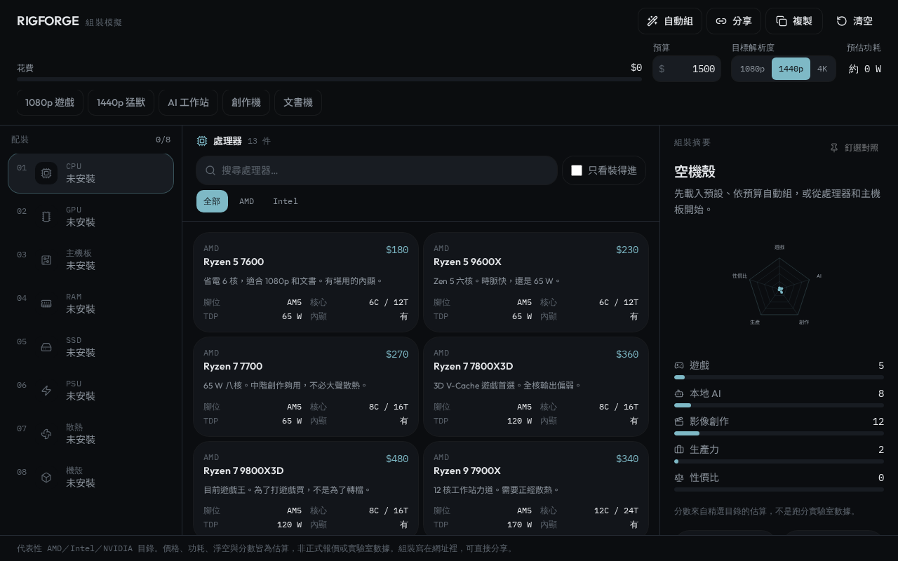
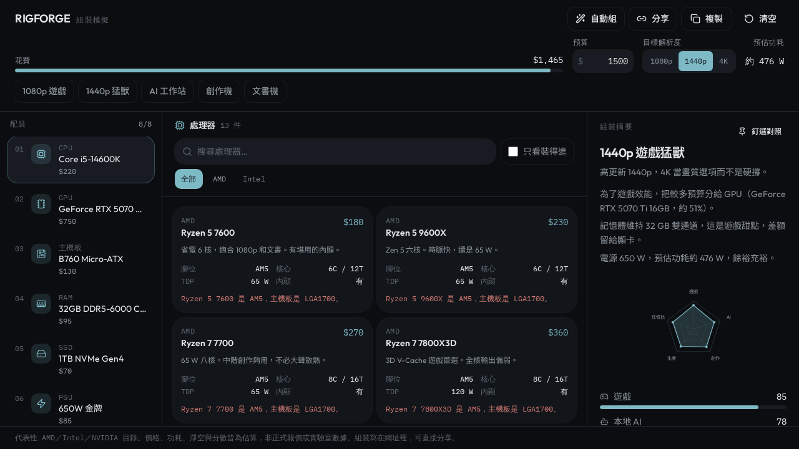
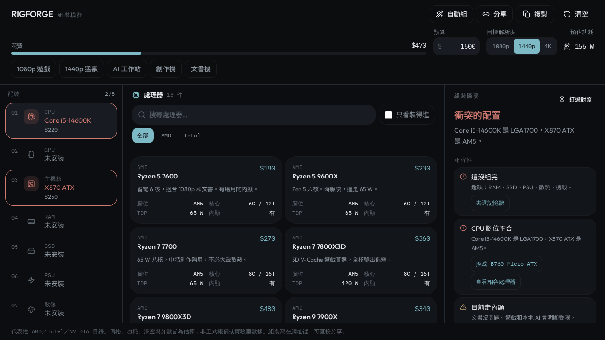
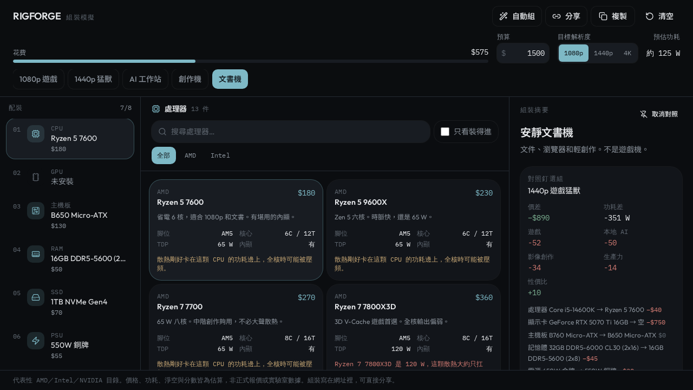

# RIGFORGE

**PC 組裝模擬器** — 像配裝遊戲一樣組電腦。即時檢查腳位、淨空與電源，並依遊戲／本地 AI／創作／文書評分。

**線上試玩：** [https://urban-tulip-able-cliff.grok.me](https://urban-tulip-able-cliff.grok.me)

[](https://www.typescriptlang.org/)
[](https://react.dev/)
[](https://tanstack.com/start)
[](https://tailwindcss.com/)

無需登入、沒有付費牆。配裝寫在網址裡，可直接分享。價格、功耗與分數皆為估算，非正式報價或實驗室數據。

<p align="center">
  
</p>

<p align="center">
  
  
</p>

---

## 做什麼

把 [PCPartPicker](https://pcpartpicker.com/) 的相容邏輯，做成遊戲配裝欄的操作方式。

- **八個槽位：** 處理器、顯示卡、主機板、記憶體、儲存、電源、散熱、機殼
- **即時相容：** CPU 腳位、主板尺寸、RAM 通道、GPU 長度、散熱淨空、電源瓦數
- **用途分數（估算）：** 遊戲、本地 AI、影像創作、生產力、性價比
- **瓶頸：** 只標低／中／高，並寫原因，不假裝精確百分比
- **預算條：** 花費對上限；不夠時不會無聲超支
- **目標解析度：** 1080p / 1440p / 4K，遊戲分數會跟著變

精選 AMD / Intel / NVIDIA 目錄，零件型號維持英文，介面為繁體中文。

## 怎麼用

| 你想做的事 | 怎麼操作 |
| --- | --- |
| 先看一組能跑的機器 | 點預設：**1080p 遊戲**、**1440p 猛獸**、**AI 工作站**、**創作機**、**文書機** |
| 依預算自動組 | 設預算與解析度 → **自動組** → 選用途（遊戲／本地 AI／創作／文書／性價比） |
| 預算不夠 | 會顯示「目前目錄最低配置約 $575，尚差 $xxx」。原配裝不動，由你決定套用或維持 |
| 腳位衝突 | 摘要變成「衝突的配置」，分數標成「相容後才有參考價值」，可一鍵換成相容主板 |
| 對照兩組 | **釘選對照** 後再改零件或預設，看價差、功耗差、用途分數與零件更換 |
| 帶走這組 | **複製** 純文字清單，或 **分享** 網址（hash 裡就是配裝） |

自動組會附簡短取捨，例如：為了遊戲效能把較多預算分給 GPU；記憶體維持 32 GB 雙通道。

<p align="center">
  
</p>

## 相容引擎（重點規則）

| 檢查 | 失敗時 |
| --- | --- |
| CPU ↔ 主板腳位 | AM5 / LGA1700 / LGA1851 必須一致 |
| 主板 ↔ 機殼 | ATX / mATX / ITX 要裝得進 |
| GPU 長度 ↔ 機殼淨空 | 常見非公版長度估算 |
| 記憶體 | DDR5、槽數、容量上限；單通道會警告 |
| 電源 | 預估功耗不夠則失敗；高 TDP 顯卡建議 ATX 3.1 |
| 散熱 | TDP 蓋不住或高度／水冷排裝不下 |

衝突時效能雷達會變淡，避免把組不出來的分數當成能跑的機器。

## 技術棧

| 層 | 技術 |
| --- | --- |
| 應用殼 | TanStack Start、React 19、Tailwind CSS v4 |
| 狀態 | Zustand + `localStorage` + URL hash |
| 相容／評分 | 純函式，見 [`src/lib/pc/`](src/lib/pc/) |
| UI | lucide-react、自訂 token（炭黑／冰青） |

不需要資料庫或帳號。邏輯集中在：

```
src/lib/pc/
  catalog.ts     精選零件目錄
  analyze.ts     相容檢查、功耗、分數、摘要、修正建議
  autobuild.ts   依預算與用途自動組、樓地板價格
  store.ts       配裝狀態、hash 分享、釘選對照
  presets.ts     五組預設機

src/components/builder/
  top-bar.tsx        預算、解析度、自動組、預設
  slot-rail.tsx      八槽配裝欄
  catalog-panel.tsx  零件目錄（可只看裝得進）
  report-panel.tsx   摘要、分數、瓶頸、對照
```

## 快速開始

需要 **Node.js 22** 與 npm。

```bash
git clone https://github.com/richie7p/rigforge.git
cd rigforge
npm install
npm run dev
```

瀏覽器開啟開發伺服器即可組裝。本專案不需資料庫或登入。

### 其他指令

```bash
npm run typecheck   # TypeScript
npm run build       # 正式建置
npm run preview     # 預覽建置結果
```

## 注意

- 價格為美元**估算**，非正式通路報價
- 功耗、淨空、分數不是實驗室跑分
- 目錄是代表性 SKU，不是完整市場清單
- 目前目錄最低完整配置約 **$575**（內顯、無獨顯）

## 線上版本

[https://urban-tulip-able-cliff.grok.me](https://urban-tulip-able-cliff.grok.me)
